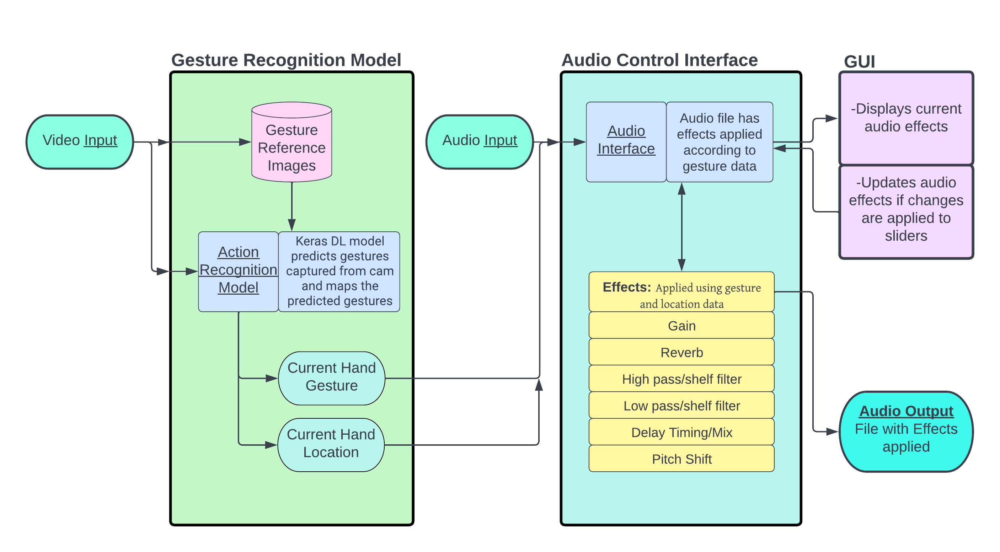

# Gesture-Controlled-Audio-Software
*CSCE 4561 - Capstone I/CSCE 4963 Capstone II Project. Using Computer Vision Action Recognition for Gesture Controlling Audio Software VST's.*
### Setup
1. Install [pedalboard](https://github.com/spotify/pedalboard)
```
pip install pedalboard
```
2. Install [PySimpleGUI](https://www.pysimplegui.org/en/latest/)
```
pip install PySimpleGUI
```
3. Install [python-osc](https://pypi.org/project/python-osc/)
```
pip install python-osc
```


## Overview:



## Computer Vision
### Action Recogniton


### Key-points


## Data Management


## Audio control
### DAW
-PySimpleGUI for interface
-pedalboard for audio processing

### parameters
Gain: -24 to +24

Stereo Pan: [L]-64 to +64[R]

Delay: 0ms to 1000ms | Mix 0%-100%

Reverb

Distortion

Equilization: Lo-pass filter


## Resources

## Contributors
Anusha Bhattacharyya
Maxx Smith
Troy Watts
Winston Phillips
