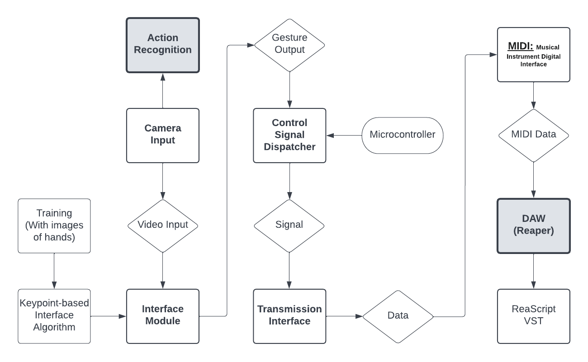

# Gesture-Controlled-Audio-Software
*CSCE 4561 - Capstone I/CSCE 4963 Capstone II Project. Using Computer Vision Action Recognition for Gesture Controlling Audio Software VST's.*
### Setup
1. Download [Reaper](https://www.reaper.fm/download.php)
2. Install [Python](https://www.python.org/downloads/) if not on machine
3. Run Reaper
4. Navigate to Options > Preferences(Ctrl + P) > Plug-ins > ReaScripts > Enable Python
5. Navigate to Actions > show actions list... > Search "Reascript" > Run ReaScript
6. Select "file_name.py" and press Run

## Overview:
Our plan...

## Computer Vision
### Action Recogniton

### Key-points

## Data Management

## Audio control
### DAW
-Reaper
-ReaScript
  - [ReaScript Documentation](https://www.reaper.fm/sdk/reascript/reascripthelp.html)
  - [Reascript Documentation for Python](https://www.reaper.fm/sdk/reascript/reascripthelp.html#p)

### parameters
Gain:

Stereo Pan:

Equilization:

## Resources

## Contributors

