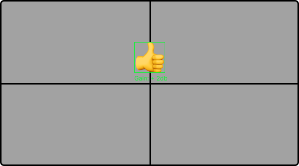
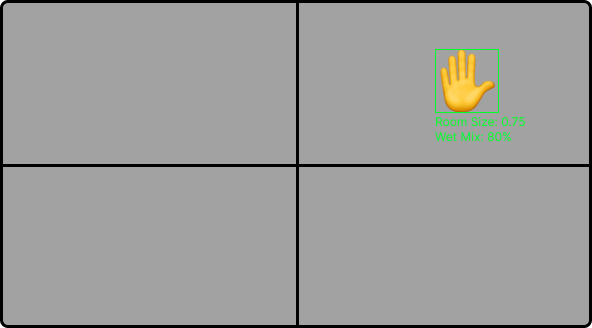
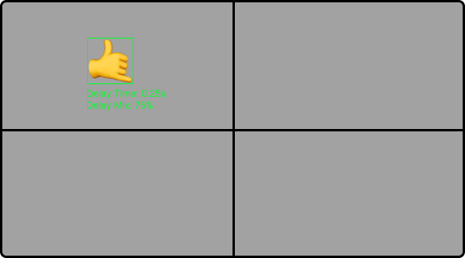
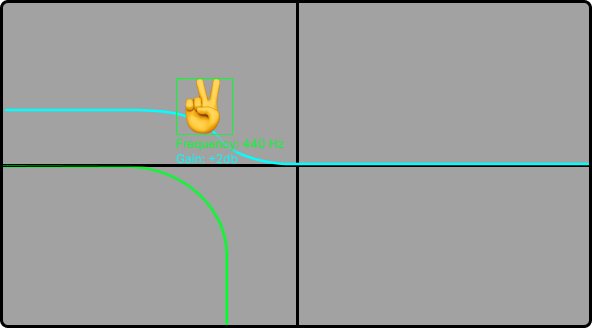

# SoundWave 

## Gesture-Controlled-Audio-Software
*CSCE 4561 - Capstone I/CSCE 4963 Capstone II Project. Using Computer Vision Action Recognition for Gesture Controlling Audio Software VST's.*
[University of Arkansas Capstone Website](https://capstone-csce.uark.edu/fall-2022-spring-2023/team-13-19-fa22/team-19-gesture-controlled-audio-software/)

### Setup
1. Install [pip](https://pip.pypa.io/en/stable/)
Check version with ```pip -V```, update pip with ```pip install --upgrade pip```
2. Install [Conda](https://conda.io/projects/conda/en/latest/user-guide/install/index.html)
3. Install [pedalboard](https://github.com/spotify/pedalboard)
```
pip install pedalboard
```
4. Install [PySimpleGUI](https://www.pysimplegui.org/en/latest/)
```
pip install PySimpleGUI
```
5. Install [numpy](https://numpy.org)
```
pip install numpy
```
6. Install [sounddevice](https://python-sounddevice.readthedocs.io/en/0.4.6/)
```
pip install sounddevice
```
7. Install [soundfile](https://pysoundfile.readthedocs.io/en/latest/)
```
pip install soundfile
```
8. Install [tensorflow](https://www.tensorflow.org/install/pip)
```
pip install tensorflow
```
9. Install [keras](https://keras.io)
```
pip install keras
```
10. Install [opencv](https://pypi.org/project/opencv-python/)
```
pip install opencv-python
```

## Introduction

    Gesture controlled music can offer a more natural and intuitive way of interacting with music, allowing for a more personal touch in music production. Our solution is an audio software application that can be controlled through gesture recognition. This allows users to manipulate audio through simple hand movements, offering a new and engaging way to interact with digital audio.

## Overview:







    First, the AI is trained with a set of gestures using video input. This trained AI is then used as an action recognition model, which passes the current gesture and location of the user’s hand to our Audio Control Interface. Using the recognized gesture and location, the interface updates the current audio effect and level, respectively. These updates are shown to the user in the GUI and are made live during playback and applied to the file.

## Design

### AI: 

    Our application employs OpenCV, Keras, TensorFlow, and NumPy to track hand movements in real-time, enabling users to control the audio playback through simple gestures. OpenCV, Keras, and TensorFlow capture and process the video stream, while NumPy is used for efficient image manipulation.

### Audio:

    Powered by pedalboard, sounddevice, and soundfile libraries. Our audio processing system allows for real-time audio effects and playback control. Pedalboard offers a range of audio effects, while sounddevice and soundfile allow for audio playback and audio file read/write for controlling audio playback, including play, pause, and stop functionalities.

### GUI: 

    Our software features an intuitive graphical user interface designed with PySimpleGUI, which enables users to control audio playback through individual sliders that represent effect variables, save effected audio files, play/pause/ and resume playback, and see gesture recognition in real time.

## Possible Future Upgrades

    Potential additions for the future include integrating more audio effects/3rd party VST's and filters, expansion to work with multiple cameras and audio files, song creation/note synthesizing, and overall time optimization. Other use cases could also be included, such as real time "air instruments", user control over home audio devices like TV's, Speakers, etc.,plug and play VST/inst pedalboard, and ASL to speech.

## Resources
[Learn about Audio Programming](https://www.theaudioprogrammer.com)

[Using Keras for gesture recognition](https://github.com/cmasch/squeezenet)

and as always, [Stack Overflow](https://stackoverflow.com)


## Contributors
[Anusha Bhattacharyya](https://capstone-csce.uark.edu/fall-2022-spring-2023/team-13-19-fa22/team-19-gesture-controlled-audio-software/auto-draft/)

[Maxx Smith](https://capstone-csce.uark.edu/fall-2022-spring-2023/team-13-19-fa22/team-19-gesture-controlled-audio-software/maxx-smith/)

[Troy Watts](https://capstone-csce.uark.edu/fall-2022-spring-2023/team-13-19-fa22/team-19-gesture-controlled-audio-software/troy-watts-student-page/)

[Winston Phillips](https://capstone-csce.uark.edu/fall-2022-spring-2023/team-13-19-fa22/team-19-gesture-controlled-audio-software/winston-phillips/)
